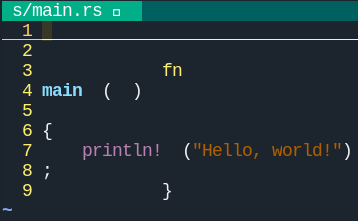
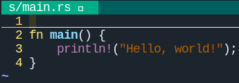
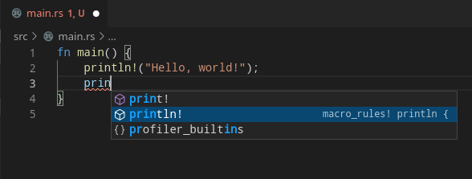

# Copyright

- The Rust trademark is owned and protected by The Rust Foundation
- [The Rust Programming Language](https://github.com/rust-lang/book) is licensed under [Apatch 2.0 and MIT terms](https://github.com/rust-lang/book/blob/main/COPYRIGHT)
- This slide is a derivative work of TRPL, and is licensed under Apatch 2.0 and MIT terms

# The Rust Programming Language - まえがき，導入

# アウトライン

- まえがき
- 導入

# まえがき

- Rustの基本原理: empowerment
  - 幅広い領域でより遠くにたどり着く力を与える
  - 例：メモリ管理，データ表現，並列性
  - 技術的に難解な部分を取り除くためのツール群を提供
- Rustを使うとこんな良い事が！
  - 並列処理コード中のミスをコンパイラが指摘してくれる
  - コマンドラインアプリからWebアプリまで，楽しいコードが自由に書ける

- TRPLは**Rustの知識**と**プログラマとしての全般の能力や自身**をレベルアップさせる！かも

# 導入 - プログラミング言語Rust

- 高速で信頼できるソフトウェアを書く手助けをしてくれる
- 書きやすさと低レベルな制御ができることは，言語設計においてトレードオフの関係
- Rustは"そこ"に挑戦している
  - **言語はモダンだけど，C言語並に細かい記述ができる！**

# 導入 - Rustは誰のためのもの？

- 開発者チーム - システムプログラミング
- 学生 - プログラミングを通じて学ぶ方なら誰でも
- 企業 - 数百の企業が様々な製品にRustを使用
- オープンソース開発者
- **スピードと安定性に価値を見出す方**
  - スピード: プログラムのスピードとソースコードを書くスピードの両方
  - 安定性: コンパイラのチェックにより，安定性を保証

# Rust開発者を助ける素敵なツール

- Cargo: 依存マネージャ兼ビルドツール
  - 1章で解説されているので割愛
- Rustfmt: 標準のコードフォーマッタ
- Rust Language Server: コード補完とエラーメッセージの検出を可能に

# Rustfmt - 概要

- [Rust Style Guide](https://github.com/rust-dev-tools/fmt-rfcs/blob/master/guide/guide.md)に従って，ソースコードを整形する
- Rust公式のコーディング規約に従うため，開発者の負担が小さい
- `rustfmt`コマンドでファイルパスを指定するだけ
  - `rustfmt src/main.rs`

# Rustfmt - 例

:::::: {.columns}
::: {.column}

:::
::: {.column}

:::
::::::

# Rust Language Server - 概要

- Language Server Protocol
  - サーバと開発ツール間の通信プロトコル
  - 従来のエディタや統合開発環境が実現していた機能を，分散的に使えるようにする仕組み
    - 機能: 補完，文法に基づく色付け，定義場所へのジャンプなど
    - 上記のような機能を開発ツールから分離したことで，再利用性を高めた
- Language Server: 上記プロトコルのサーバ，実装ごとに特定の言語をサポート
- Rust用のLanguage Server: [rls](https://github.com/rust-lang/rls)

# Rust Language Server - 例

:::::: {.columns}
::: {.column}
- Visual Studio CodeでLanguage Serverを使ってみる
- 色付けされていることが分かる
- コードを書き始めると，補完もしてくれるようだ
:::
::: {.column}

:::
::::::

# 導入 - この本の使い方

- 概念の章とプロジェクトの章
  - 概念の章: Rustの一面を学ぶ
  - プロジェクトの章: 概念の章で学んだことを使い，小さなプログラムを構築
    - 2章: 数当てゲーム
    - 12章: 簡易grep
    - 20章: Webサーバを作ります
- **本を読みつつ，Rustコードを書いてみましょう！**

